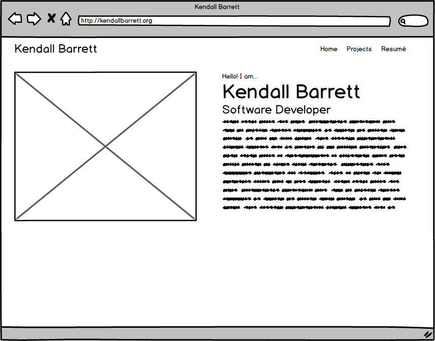

# Build a portfolio site

## Directions

In this homework, you will build a web site about yourself. The website should have:

* A homepage with your picture and some information introducing yourself, as well as links to other places you can be found online.
* A project page that lists your two projects so far and links to them.
* A page showing your resumé in HTML.

Your website should use CSS for layout and semantic HTML for markup. It should be responsive and look good on mobile devices as well as on the desktop.

## Example wireframes

Your site does not have to have the same layout as these wireframes, but they are a good place to get started if you do not have another idea.

### Mobile

![mobile resumé]example img/(mobile-resume.png)

### desktop

